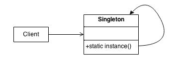
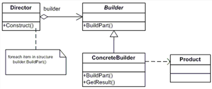

# ***Design Patterns***

## Sobre

Design patterns são padrões codificação existentes em projetos. Eles foram criados direcionados a projetos desenvolvidos no paradigma ***Orientado a Objeto***, principalmente porque existiam problemas nos códigos que eram sempre resolvidos da mesma maneira. Dessa forma e consequentemente eles ajudam na limpeza do código e mantenabilidade do projeto, tornando-o menos sucetível a erros.

## Tipos de padão de projeto

Os padões de projeto, depois de definidos, foram separados em 4 categorias principais.

* ***Creational Patterns*** (Padrões de Criação)
* ***Structural Pattern***s (Padrões de Estruturação)
* ***Behavioral Patterns*** (Padrões de Comportamento)
* ***J2EE Patterns***

### Creational Patterns

São os padrões que ***disponibilizam formas de criação de entidades***. Eles evitam que você precise ficar criando novos objetos diretamente pelo construtor (utilizando o operador *new*), e lidam com a lógica de construção de determinado objeto para determinado contexto. 

Neste artigo veremos os seguintes padrões criacionais:

* ***Singleton***
* ***Factory***
* ***Builder***


### Structural Patterns

São padrões de projeto que ***facilitam o relacionamento entre entidades***. Os conceitos de herança e interface são muito utilizados para compor objetos com funcionalidades novas. 

Neste artigo veremos os seguintes padrões estruturais:

* ***Adapter***

### Behavioral Patterns

São padrões de projeto que ***lidam com o comportamento e comunicação entre as entidades*** do projeto. 

Neste artigo veremos os seguintes padrões comportamentais:
 * ***Observer***
 * ***State***

## Implementação e definições

### Creational

#### Singleton

A idéia do sigleton é que tenhamos uma classe-objeto que pode ser intanciada ***apenas uma vez***, com visibilidade e acesso global a essa instância. Você pode verificar melhor no diagrama abaixo: 



Para implementar o singleton, você precisa criar uma classe, em que um de seus atributos é uma ***instância privada estática da própria classe***.

`

```java
/** * This class represents an object with the singleton design pattern */
public class SingletonObject {    
    /**     
    * It has the attribute <b>instance</b> that is the only instance created of this object in the project scope     
    */    
    private static SingletonObject instance;    
```

`

Depois de criar essa classe, para que o singleton realmente aconteça, você deve impossibilitar a criação de novas instâncias da classe. Para isso, será implementado um contrutor padrão vazio e ***iremos alterar o acesso dele para privado***.

`

```java
/** 
* This class represents an object with the singleton design pattern 
*/
public class SingletonObject {    
    
    /**     
    * It has the attribute <b>instance</b> that is the only instance created of this object     
    */    
    private static SingletonObject instance;    
    
    //TODO: You can put other attributes here as you wish, but it cannot infer in the pattern. 
    
    /**     
    * A private empty constructor so it is not possible to create another instance of this object     
    */    
    private SingletonObject(){}
}

```

`

E agora você deve estar se perguntando "se eu alterei o meu construtor para privado, como devo acessar a instância da classe já que ela também é privada?". A resposta é simples: você irá **criar o método _getInstance()_**, que irá te dar acesso à instância da classe e somente ela.

A implementação do método é a seguinte: 

`

```java
/** 
* The method <i>getInstance()</i> is the only way you can access the <b>single instance</b> of the object 
* @return th single instance possible of an object 
*/
public static SingletonObject getInstance(){    
    if (instance == null) {        
        instance = new SingletonObject();    
    } else{ 
        System.out.println("Uses already created instance."); 
    }
    
    return instance;
}
```

`

Agora você só precisa adicioná-lo a sua classe e você terá agora um objto singleton dessa forma:

`

```java
public static void main(String[] args){    
    System.out.println("Starts demonstration of the design patterns implementation and functions.\nYou can debug the code if you want to see line by line.");    
       
    SingletonObject fistCall = SingletonObject.getInstance();
    SingletonObject secondCall = SingletonObject.getInstance();
}
```

`

O Output será: 

`Starts demonstration of the design patterns implementation and functions.
You can debug the code if you want to see line by line.
Creates the new instance because it is required for the first time
Uses already created instance.`

#### Factory

Factory é o padrão que fornece a possibilidade de criarmos uma ***fabrica para criação dos nossos objetos em tempo de execução***, deixando o cliente isento de instanciar a classe ganhando um dinamismo para a aplicação.

Primeiramente é criada uma classe abstrata que servirá de base para o objeto que quer ser instanciado.

`

```java
public abstract class BaseClass {    
    private int something;   
    
    public BaseClass(int something){        
        this.something = something;    
    }    
    
    @Override    
    public String toString() {        
        return "BaseClass{" +                
            "something='" + 
            something + 
            '\'' +                
            '}';    
    }
    
    public abstract void doSomething();
}
```

`

Depois disso, criaremos as classes filhas dessa classe que acabamos de criar, pois é nelas que fazemos a implementação dos métodos abstratos e suas especializações.

`

```java
public class ImplementationOne extends BaseClass {    
    
    private String someOtherThingHere;    
    
    public ImplementationOne(int something, String someOtherThingHere){
        super(something);        
        this.someOtherThingHere = someOtherThingHere;
        System.out.println("Builds object with ImplementationOne especifications: " + this.someOtherThingHere);
    }    
    
    @Override    
    public void doSomething() {        
        System.out.println("Enters the method doSomething() of ImplementationOne: " + this.someOtherThingHere);    
    }
}
```

`

`

```java
public class ImplementationTwo extends BaseClass {    
    
    private String someOtherThingHereToo;    
    
    public ImplementationTwo(int something, String someOtherThingHereToo){        
        super(something);        
        this.someOtherThingHereToo = someOtherThingHereToo;
        System.out.println("Builds object with ImplementationTwo especifications: " + this.someOtherThingHereToo);
    }    
    
    @Override    
    public void doSomething() {        
        System.out.println("Enters the method doSomething() of ImplementationTwo: " + this.someOtherThingHereToo);    
    }
}
```

`

Agora criaremos a fábrica de objetos. Ela sera uma classe com métodos estáticos. Nesse caso, para exemplo, teremos apenas uma classe.

`

```java
public class ClassFactory {    
    
    public static BaseClass createClass(int something, String somethingElse){        
        
        switch (something){            
            case 1:                
                return new ImplementationOne(something, somethingElse);            
            case 2:                
                return new ImplementationTwo(something, somethingElse);            
            default:                
                return null;        
        }    
    }
}
```

`


Pronto. Agora para fazer a criação do método, faremos o seguinte:

`

```java
public static void main(String[] args){    
    System.out.println("Starts demonstration of the design patterns implementation and functions.\nYou can debug the code if you want to see line by line.");    
    
    int type = 1;    
    String conteudo = "Content 1";    
    ClassFactory.createClass(type, conteudo);    
    
    type = 2;    
    conteudo = "Content 2";        
    ClassFactory.createClass(type, conteudo);

}
```

`

Fazendo assim, o output seria: 

`Starts demonstration of the design patterns implementation and functions.
You can debug the code if you want to see line by line.
Builds object with ImplementationOne especifications: Content 1
Builds object with ImplementationTwo especifications: Content 2`


#### Builder

O padrão Builder é um padrão de projetos de software comum que é usado para ***encapsular a lógica de construção de um objeto***. Este padrão é frequentemente utilizado quando o processo de construção de um objeto é considerado complexo e também é adequado quando se trata da construção de representações múltiplas de uma mesma classe.




A implementação fica assim:

Primeiro você cria a sua classe complexa já com construtor e todos os atributos que a compõem.

`

```java
public class ObjectOne {    
    private String attributeOne;    
    private String attributeTwo;    
    
    public ObjectOne(String attributeOne, String attributeTwo){ 
        this.attributeOne = attributeOne;        
        this.attributeTwo = attributeTwo;    
    }
}
```

`

Ate esse ponto, tudo normal como você já conhecia. 

Agora entramos na parte de realmente implementar o builder. Dentro da própria classe que você acabou de criar, você vai criar uma outra classe publica estática chamada builder. Dentro dela, você vai colocar os mesmos atributos da sua classe de criação.

`

```java
public class ObjectOne {    
    private String attributeOne;    
    private String attributeTwo;    
    
    public ObjectOne(String attributeOne, String attributeTwo){ 
        this.attributeOne = attributeOne;        
        this.attributeTwo = attributeTwo;    }   
    
    /**     
    * Builder static class is the one who is going to be responsible for the logic to create the object.     
    */    
    public static class Builder {        
        private String attributeOne;        
        private String attributeTwo;        
        
        public Builder(){}        
        
    }
```

`

Dentro da classe builder é onde serão implementadas as lógicas de criação daquele determinado objeto. 


`

```java
/** 
* Builder static class is the one who is going to be responsible for the logic to create the object. 
*/
public static class Builder {    
    private String attributeOne;    
    private String attributeTwo;    
    
    public Builder(){}    
    
    public Builder setAttributeOne(String attributeOne){ 
        this.attributeOne = attributeOne;
        System.out.println("Sets attribute one: " + attributeOne);
        return this;    
    }    
    
    public Builder setAttributeTwo(String attributeTwo){ 
        this.attributeTwo = attributeTwo;
        System.out.println("Sets attribute Two: " + attributeTwo);
        return this;    
    }    
    
    public ObjectOne build(){
        System.out.println("Finnaly builds Object");
        return new ObjectOne(attributeOne, attributeTwo);    
    }
}
```

`

Pronto. O uso do método ficaria: